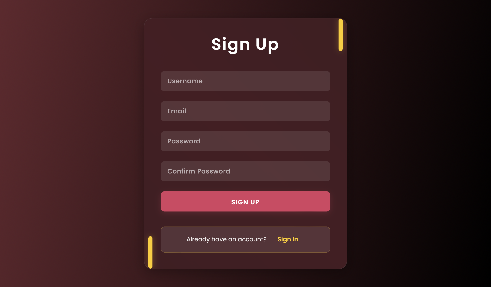
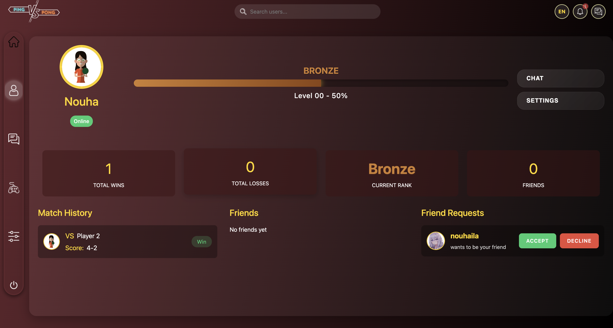

# 🕹️ Pong Connect (Transcendence)

A modern twist on the classic Pong game — built as part of the **Transcendence** project. This web-based application reimagines the nostalgic gameplay of Pong with a fresh and responsive design. Developed using Django Rest Framework on the backend and Vanilla JavaScript on the frontend, the project focuses on delivering a smooth local multiplayer experience and an engaging tournament mode. With a clean UI, solid architecture, and a collaborative development approach, Pong Connect showcases our team’s ability to integrate design, logic, and usability into a cohesive and enjoyable game experience.

## 🚀 Features

- 🎮 **Local Multiplayer** – Play with a friend on the same device.
- 🏆 **Tournament Mode** – Compete in a tournament.
- ⚡ Smooth gameplay experience with responsive controls.
- 🖥️ Intuitive UI built with Vanilla JS frontend.
- 🌱 Backend powered by Django RestFramework.

## 📸 Screenshots

<!-- You can add screenshots like this -->






## 🛠️ Tech Stack

- **Frontend:** Vanilla JS (SPA), HTML, CSS
- **Backend:** Python (Django RestAPI)
- **Database:** PostgreSQL
- **Deployment:** Docker

## 🧑‍💻 Getting Started

Clone the repo and run it locally:

```bash
git clone git@github.com:nouhaerr/PongConnect.git pong-connect
cd pong-connect
```
### 🔧 Environment Setup

Before running the project with Docker, create a `.env` file in the root directory. Here’s an example of what it might contain:

```env
SECRET_KEY='django-insecure-(w6my)#+n=a5^#-p*4vzq*+)#ph1jxo+&lqns6m#$(vzoqce$r'
FT_TRANSCEDENCE_HOST="localhost"
POSTGRES_USER=""
POSTGRES_PASSWORD=""
POSTGRES_DB="transcendence"
POSTGRES_HOST=""
POSTGRES_PORT=""
# Intra credentials
INTRA_CLIENT_ID=""
INTRA_CLIENT_SECRET=""
#PGADMIN credentials
PGADMIN_DEFAULT_EMAIL=""
PGADMIN_DEFAULT_PASSWORD=""
#FRONTEND URLs Public (https)
FRONTEND_URL="https://localhost/"

#BACKEND private URLs
PLAYER_MANAGEMENT_URL="/player_management/"
AUTHENTICATION_URL="/authentication/"
```
### 🐳 Using Docker

To build and run the project with Docker, use the provided Makefile:
```bash
make
```
This will build and start the following containers:

- Database Container: PostgreSQL container to manage data persistence.
- Frontend Container: Angular frontend for the user interface.
- Backend Container: Django backend to handle API requests and logic.
- pgAdmin Container: A containerized pgAdmin instance for managing the database.
- Celery Container: A container for handling asynchronous background tasks.
  
Docker Compose will handle the orchestration of all the containers, ensuring each service is configured and linked correctly. After running the make command, the application will be up and running, ready to serve the frontend, backend, and handle database operations seamlessly.

## 🤝 Collaborators

- [**Badr**](https://github.com/SAINT-CLAIRE-MERODE) – Frontend development (SPA + responsive UI using Vanilla JS).
- [**Nouhaila**](https://github.com/nouhaerr) – Backend(user management), authentication, 2.0auth, and database management.
- [**Mahdi**](https://github.com/elmahdidiab) – Local multiplayer gameplay and tournament logic with match history.
- [**Hayat**](https://github.com/hayat100) – Development of the second game Tic-tac-toe.
